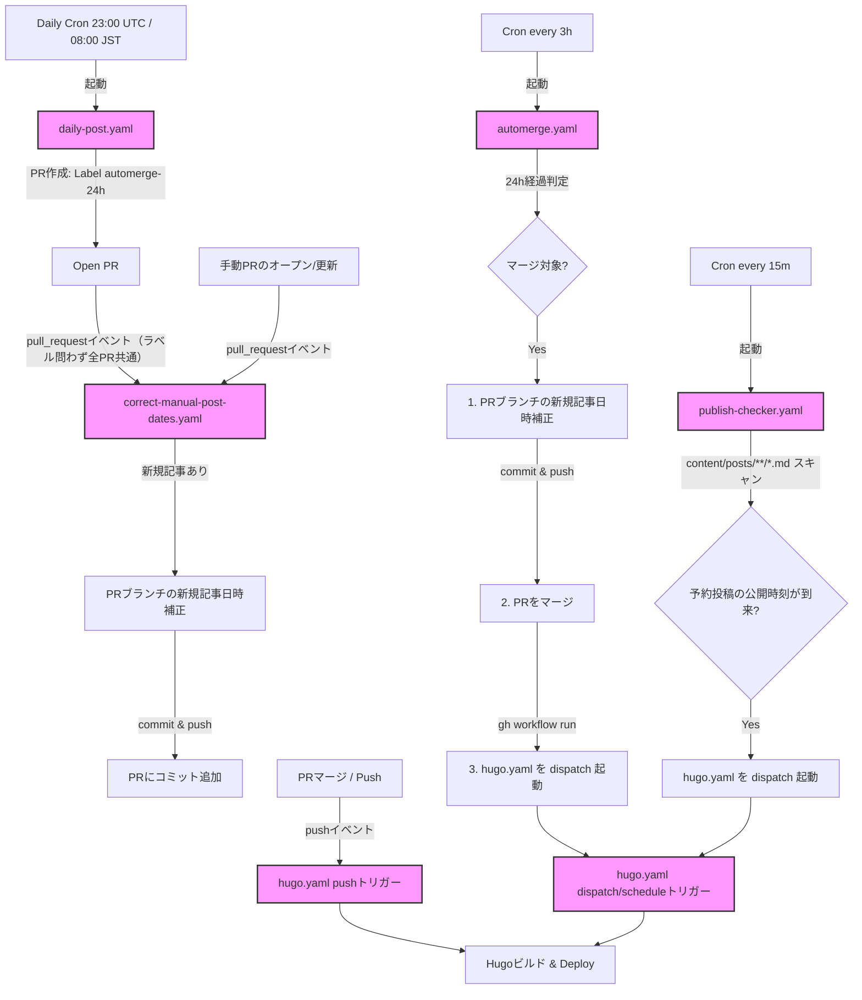

# デプロイフローおよび公開日時補正仕様

このドキュメントでは、本ブログにおける記事生成から自動マージ、日時の自動補正、予約投稿、およびデプロイ（GitHub Pagesへの配信）に至るワークフローの全体像と詳細な仕様について説明します。

---

## 1. ワークフロー全体図と役割

本リポジトリは、以下の5つのGitHub Actionsワークフローを組み合わせて運用されています。

- **`daily-post.yaml` (Daily Automated Post)**: 日次自動投稿作成
- **`automerge.yaml` (Auto-Merge AI Posts)**: 24時間経過後の自動マージ & マージ前日時補正 & デプロイ即時起動
- **`correct-manual-post-dates.yaml` (Correct Manual Post Dates)**: すべてのPR（`automerge-24h`ラベル付きも含む）に対する、PR作成・更新時の日時補正
- **`hugo.yaml` (Deploy Hugo site to Pages)**: ブログビルド＆デプロイ（日時補正は行いません）
- **`publish-checker.yaml` (Scheduled Publish Polling)**: 予約投稿用のポーリング＆デプロイ自動起動

### ワークフローの実行順序とトリガー関係



---

## 2. 制約と解決策：GITHUB_TOKEN および Branch Protection の制限

### 1. GITHUB_TOKEN の仕様制限
GitHub Actionsのセキュリティ仕様として、ワークフロー内で自動的に利用される `GITHUB_TOKEN` を使用してPull Requestのマージを行うと、**それによって生じたイベント（例: masterへのpush）は他のワークフローの `push` トリガーを起動しません**（無限ループ防止のためのガード）。

以前の構成では、`automerge.yaml` がPRをマージしていましたが、これにより `hugo.yaml` の `on: push` が起動せず、マージ後デプロイされるまでに最大6時間のスケジュール遅延が発生していました。
**【解決策】** `automerge.yaml` でマージが成功した直後に、GitHub CLIを使用してデプロイワークフロー（`hugo.yaml`）を `workflow_dispatch` で明示的に即時起動するようにしました。

### 2. Branch Protection の制限
`master` ブランチのBranch Protection（`required_pull_request_reviews` 有効・`enforce_admins: true`）により、ワークフローから `master` ブランチへの直接の `git push` は拒否されます。
以前は手動マージ時に `hugo.yaml` が日時補正を行って `master` へ直接コミットをpushしようとしていましたが、これは常に失敗してデプロイ処理自体が止まってしまいます。
**【解決策】** すべての日時補正処理をマージ前（各PRのブランチ上）で行うよう統一しました。`correct-manual-post-dates.yaml` はラベルの有無を問わず**すべてのPR**に対してPR作成・更新時に補正を行い、さらにAI自動生成記事（`automerge-24h`ラベル付き）については `automerge.yaml` が24h経過後のマージ確定時にも改めて補正します。これにより、`master` にマージされた時点ではすでに正しい日時になっているため、`hugo.yaml` は日時補正処理を持たず、ビルド＆デプロイ処理に専念します。

> [!IMPORTANT]
> **`correct-manual-post-dates.yaml` が `automerge-24h` ラベル付きPRを除外しない理由**
> 当初は「AI生成記事の日時補正は `automerge.yaml` が担当する」という前提で除外していましたが、これだと**人間が24h経過を待たずに手動でAI生成記事のPRをマージした場合**、日時が一切補正されないまま（生成時刻のまま）masterに入ってしまう抜け穴がありました。`automerge.yaml` はあくまで「自分がマージするタイミング」でしか補正しないため、それより前に人間が先にマージしてしまうと出番がありません。この抜け穴を塞ぐため、`correct-manual-post-dates.yaml` は全PR共通で動作するようにしています。通常通り `automerge.yaml` がマージする場合は、後から改めて（より正確なマージ確定時刻で）補正commitが追加されるため、二重補正になりますが実害はありません。

---

## 3. 日時補正ルール

本ブログでは、記事の公開タイミング（`date:` フロントマター）と実際のサイト上での表示・公開日時を一致させるため、自動的な日時補正ルールが適用されます。

### 日時補正のルール一覧

1. **新規追加ファイルのみが対象**
   - 補正が走る際、既存の過去記事に影響を与えないよう、**そのプルリクエストで「新規追加されたファイル」のみ**を日時補正の対象にします。
   - **ガードの仕組み**:
     - `automerge.yaml`（AI生成記事のマージ確定時）および `correct-manual-post-dates.yaml`（全PRのPR作成・更新時）では、PRの差分情報を取得し、ステータスが `added` である `content/posts/*.md`（`_index.md` を除く）のみを抽出して補正スクリプトに渡します。
     - `hugo.yaml`（デプロイ）では、日時補正処理自体を行いません。
   - これにより、既存記事の日時が勝手に現在時刻に上書きされる問題を防いでいます。

2. **現在時刻以下なら「公開確定時刻」に書き換え**
   - 新規記事の `date:` が「現在時刻以下（過去または現在）」の場合、公開が確定した（またはPRブランチ上で補正された）時点の時刻（`+09:00` JST表記）に書き換えられます。
     - どのPRも `correct-manual-post-dates.yaml` によって、PRの作成（opened）または同期（synchronize）のイベント時にまず補正されます。
     - AI自動生成記事（`automerge-24h`ラベル付き）は、通常通り `automerge.yaml` が24h経過後にマージする場合、マージ確定時刻でさらに上書き補正されます。人間が24h経過前に手動でマージした場合は、上記のPR作成・更新時の補正のみが反映されます。

3. **未来日付はそのまま尊重（予約投稿）**
   - `date:` が現在時刻より未来である場合は、補正ロジックは何も行わず、日付をそのまま維持します。これにより「予約投稿」として扱われます。

4. **タイムゾーン表記の統一**
   - 補正後の日時は、常に日本標準時（JST）の `+09:00` 表記（例: `2026-08-21T18:52:08+09:00`）に統一されます。

---

## 4. 予約投稿（未来日付指定）の使い方

将来の特定の時間に記事を自動公開したい場合、以下の手順で予約投稿を行うことができます。

### 予約投稿の手順

1. **記事の `date:` フロントマターに未来の日時を指定する**
   - 日本時間（JST）の `+09:00` 形式で指定してください。
   ```yaml
   ---
   title: "将来公開するテスト記事"
   date: 2026-08-25T09:00:00+09:00
   draft: false
   ---
   ```
2. **通常どおりPRを作成し、マージする**
   - マージ時の補正ロジックは、未来の日付を検知すると書き換えを行いません。そのため、未来日付のままmasterにマージされます。
   - Hugoのビルド設定では未来日付の記事は除外されるため、この時点ではまだサイト上には公開されません（ビルド成果物に含まれません）。

### 自動公開の仕組み（ポーリング）

- 新規ワークフロー `publish-checker.yaml` が **15分間隔** で実行されます。
- このワークフローは `content/posts/**/*.md` の `date:` フィールドをスキャンし、**「現在時刻以下」かつ「現在時刻から20分前まで（ルックバック窓）」** に公開予定時刻が到来した記事があるかをチェックします。
- 該当する記事が検知されると、自動的に `hugo.yaml` を `workflow_dispatch` で起動します。
- これにより、Hugoのビルド対象にその記事が含まれるようになり、サイト上に公開されます。

> [!NOTE]
> **公開時の遅延について**
> ポーリングが15分間隔であるため、指定した公開予定日時から実際にサイトに反映されるまでは、**最大で 15分 ＋ GitHub Actions の実行遅延** の遅延が発生する可能性があります。実測では、GitHub Actionsの `schedule` トリガー自体が混雑状況により**10分以上遅延する**ことも確認されています（GitHub側の既知の仕様で、リポジトリ側では制御できません）。正確な分秒単位の公開を要求する場合は、余裕を持った時間を指定してください。取りこぼした場合も、1日1回の `hugo.yaml` の `schedule` が最終的な安全網として機能します。

---

## 5. 補正commitによるセルフトリガーと承認

`automerge.yaml` と `correct-manual-post-dates.yaml` が日時補正commitをPRブランチへpushすると、そのpush自体が新たな `synchronize` イベントを発生させます。このリポジトリでは、`github-actions[bot]` 名義のpushによって発生した `pull_request` トリガーのワークフロー実行（`build`・`test` を含む）は、`daily-post.yaml` が作成するPRと同様に**手動承認待ち（`action_required`）** の状態になります。

これを放置すると、必須ステータスチェック（`build`・`test`）が永久に承認されないままとなり、人間によるマージがブロックされたり（`correct-manual-post-dates.yaml` のケース）、`automerge.yaml` 自身の直後の `gh pr merge` が失敗したりします。そのため、両ワークフローとも補正commitのpush後に以下を行います。

1. 対象ブランチの `action_required` なワークフロー実行を検索し、`gh api .../actions/runs/{id}/approve` で承認する
2. （`automerge.yaml` のみ）承認後、`gh pr checks --watch` で必須チェックの完了を待ってから `gh pr merge` を実行する

なお、`automerge.yaml` が補正後にPRブランチから元のブランチへ戻る際は、必ず `master`（名前付きブランチ）にcheckoutします。SHAで直接checkoutするとdetached HEAD状態になり、`gh pr merge --delete-branch` が「ブランチを特定できない」というエラーで失敗する（マージ自体はAPI経由で成功していても）ことが実際の検証で確認されているため、この点は変更しないでください。
