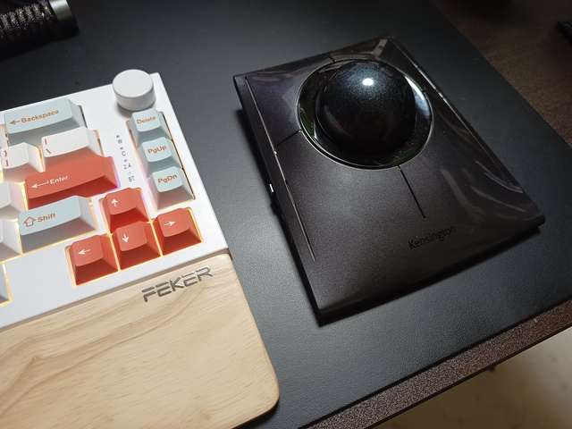

ながいあいだ, ロジクールのトラックボール M575 を使っていたが,
SlimBlade Pro に乗り換えてみた.
使い始めて2ヶ月ほど使用感などを紹介してみる.

M575と比較しての感想が多いと思う.

<!--more-->

## 大玉トラックボールがもたらす体験

ロジクールのM575はいわゆる親指でボールを動かしてカーソル操作するトラックボール.
それに対して, ケンジントンのSlimBladeはど真ん中に大きめのボールが配置されていて, 手のひら全体というか3本から5本の指をかぶせるようにボールに添えて操作するイメージ.

M575のようなトラックボールは,
一般的な既製のマウスとボールによるカーソル操作くらいしか違いがないといえる. 
たとえば, 人差し指で左クリック, 中指で右クリック, その間にスクロール用のホイールがある点などは,
ふつうのマウスと変わらない.

SlimBladeやおそらく他の類似製品もだけど, このあたりの体験が全く異なっている.
ほとんどの場合, 左クリックに親指, 右クリックに薬指もしくは小指を使うことになる.

大玉トラックボール以外のポインティングデバイスでは得難い体験がある.
ここに興味を持てたなら, 試してみる価値がある.

## スクロールが面白い

大玉トラックボールでスクロール操作をどう実装するかはけっこう悩ましいポイントであるらしい.

SlimBladeはボールを水平方向に回すことでスクロールできるようになっている.
ボールの外周のリングに指を添えて動かす感じで,  少し雑につかんで回してもOK.

スクロール時, トラックボールに内蔵されているスピーカーが「カチカチ」という音をだすようになっていて,
これが「スクロールしている感」を演出しており, これがけっこう心地良い.
用もなく回したくなる気持ちよさがある.

他のレビューを見た感じ, 昔からよく知られたSlimBladeのチャームポイントのひとつ.

同じケンジントンの大玉トラックボールであるExpert Mouse シリーズは,
ボールの外周部に配置されたリングを回すことでスクロールするようになっている.
SlimBladeを買った後に調べて知って興味を持ったけど, 気軽に試せる価格ではないかな…….

## 慣れは必要. おそらくM575以上に

最初に述べた通り, SlimBladeは中央のボールを3本から5本の指で操作し,
親指と薬指or小指でクリック操作をおこなう.
既存のポインティングデバイスと大きく違う使用方法になる.

ここが使い始めた当初に不安を感じたところで, カーソルを思ったところへ移動するのに時間がかかったり,
クリック操作したときにボールに触れてカーソルを動かしてしまうといったことがあった.
できの悪いタッチパッドでけっこうありがちな事象.

普段, クリック操作に使うことがない指を使うことになる点と相まって,
M575より気持ちよく使えるまでにかかる時間は必要かなと思った.

カーソル操作については, OS側のカーソル速度を最低近くまで落として, SlimBlade本体右側にあるDPI切り替えボタンで調整することで使いやすくなった.

それでも, たとえば文字列を選択するときなどの「左クリックボタンを押したままカーソル移動」といった操作は今でも苦手.
個人的になそんなに使わない操作ではあるし,
トリプルクリックによる行ごと選択で代替できるところはそうするなど,
ストレスを感じないようにする工夫もしている.

## スイッチはM575より悪い

ロジクールのM575も, 先代のM570も, クリックのスイッチはクソだと思う.
「カチッ」って音と感触が今どきのマウスの品質ではない.
クリック操作時の音がヘッドセットを通じて相手側に聞こえるほど.

SlimBladeのスイッチはたぶんそれ以上にクソ.
「カチ」音がうるさいのに加えて, ストローク量も必要以上にある印象.
構造上しょうがないところもあるかと思うけど.
フラグシップ感ある製品ではあるので, このあたりもう少し妥協なく設計できないものかと思わないでもない (SlimBladeシリーズに限った話ではないけど).

## 高いが満足感はじゅうぶん

ぼくはAmazon限定を2月に13,800円で購入した (今みたらけっこう高くなってて驚いた).

通常のモデルはボールが赤いけど, Amazon限定のほうは黒いボール.
見た目の質感がよくて, 所有する喜びがある.

ポインティングデバイスとしては躊躇する価格で, 人を選ぶ製品でもある.
ここで紹介した美点や特徴に興味があり,
ウィークポイントを受け入れられるなら価格以上の価値があるのではと思った.

ぼくは気に入って使っています.

