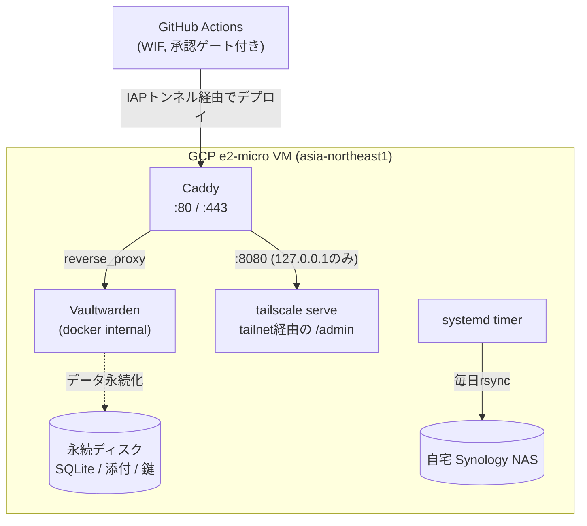

パスワードマネージャーを自前ホストするなら、Bitwarden 互換の軽量サーバー実装である Vaultwarden が定番の選択肢だ。ただ、動かすだけなら Docker Compose 一発で済むところを、ぼくのプロジェクトでは GCP + Terraform + GitHub Actions + Tailscale を組み合わせて、それなりに作り込んだ運用基盤にしている。

意識したことはいくつかあり、主には可用性・信頼性・セキュリティだ。**Vaultwarden の `/admin` パネルは「招待リンクを見る」以外の用途では触らない。** サインアップ制限、2段階認証の許可手段、SMTP、管理パネルそのものの保護方式まで、設定はすべて環境変数・Terraform・GitHub Actions のどこかに書いてあり、git の差分として残る。この記事ではその全体像を、インフラ層 → コンテナ設定 → ネットワーク境界 → デプロイパイプライン → バックアップの順に紹介する。

## 全体構成



## 1. インフラ: GCPに最安構成で、しかし守るべき所は守る

Terraform でプロビジョニングしているのは以下の通り(`terraform/main/`)。

- **VM**: `e2-micro`、東京リージョン(`asia-northeast1`)、Debian 13。Preemptible/Spotのような強制停止されうる構成はあえて使わない(個人利用でも可用性は落としたくない)。東京リージョンを選んだのは可用性と、USリージョンのインスタンスをn8nで使っていたため、無料枠の恩恵が受けられなかったから
- **静的External IP**: VMを作り直しても同じIPを維持する。DNSを都度張り替えずに済む
- **専用永続ディスク**(`pd-balanced`、10GB): SQLiteはfsyncが多く、`pd-standard`(HDD相当)のIOPS上限だと体感できるレベルで遅くなるためSSD相当を選択。`prevent_destroy`ライフサイクルを設定しており、VM側だけを作り直す操作(マシンタイプ変更など)でうっかりデータディスクを巻き込んで消してしまうことを防いでいる
- **ファイアウォール**: 公開インターネットからは80/443番のみ許可。22番(SSH)は公開ファイアウォールに一切登場しない
- **Secret Manager**: `ADMIN_TOKEN`、Tailscale認証キー、SMTP認証情報、NASバックアップ用パスワードを保管。VM実行時のサービスアカウントは、自分が使うシークレットに対する`secretAccessor`のみを持ち、他は一切読めない。Terraform/CI用の管理者向けサービスアカウントとも別人格にしてある
- **OS自動セキュリティ更新**: `unattended-upgrades`を起動時に有効化

小さなVM1台の個人プロジェクトでも、「公開ポートの最小化」「機密情報の最小権限アクセス」「データのライフサイクル分離」の3点は妥協していない。

## 2. Vaultwarden 本体の設定 ── ぜんぶ環境変数

`vaultwarden/docker-compose.yml` に書かれている環境変数が、実質的な「管理パネルの代わり」になっている。

```yaml
environment:
  DOMAIN: ${DOMAIN}
  ADMIN_TOKEN: ${ADMIN_TOKEN}
  SIGNUPS_ALLOWED: "false"
  WEBSOCKET_ENABLED: "true"
  IP_HEADER: "X-Forwarded-For"
  _ENABLE_EMAIL_2FA: "false"
  SMTP_HOST: ${SMTP_HOST}
  SMTP_PORT: ${SMTP_PORT}
  SMTP_SECURITY: ${SMTP_SECURITY}
  SMTP_USERNAME: ${SMTP_USERNAME}
  SMTP_PASSWORD: ${SMTP_PASSWORD}
  SMTP_FROM: ${SMTP_FROM}
  SMTP_FROM_NAME: ${SMTP_FROM_NAME}
```

それぞれの狙いは以下の通り。

- **`SIGNUPS_ALLOWED: "false"`** — 自己サインアップを禁止し、招待制のみにする。招待メールはSMTPが設定されていれば自動送信される
- **`IP_HEADER: "X-Forwarded-For"`** — ログイン試行のレート制限や監査ログに、実際の接続元IPを記録させるための設定。これが地味に厄介で、後述する
- **`_ENABLE_EMAIL_2FA: "false"`** — 2段階認証の選択肢から「メールアドレス」を外す。メール自体が攻撃対象になりうる手段なので、TOTP・FIDO2 WebAuthn・Duo Securityだけを選べるようにする
- **`ADMIN_TOKEN`** — 平文ではなく、起動のたびに生成されるArgon2idハッシュ(後述)

### IP_HEADERまわりの小さな罠

`X-Forwarded-For`をVaultwardenに信用させるには、Caddy側が信頼できる形でこのヘッダーを付与している必要がある。今回のトポロジーでは:

- `Caddyfile`の`trusted_proxies`は**意図的に未設定のまま**にしている。Caddyがインターネットに直接面するエッジなので、`trusted_proxies`が空だと「クライアントが送ってきた`X-Forwarded-For`を丸ごと捨てて、Caddy自身が観測した接続元IP1つだけで上書きする」という動きになる。これはCaddyのデフォルト実装の話で、Caddyfileに何かを書いて実現しているわけではない
- 一方Vaultwarden側は、`X-Forwarded-For`にカンマ区切りで複数の値が来ても**先頭(左端)の値だけを信用する**実装になっている
- この2つが組み合わさることで、「クライアントがどんな`X-Forwarded-For`を送っても、Caddyを通過した時点で必ず正しい値に上書きされる」という、なりすまし不可能な状態が成立する

ただしこれは「`trusted_proxies`が未設定である」という非自明な前提に依存している。将来「複数プロキシに対応するため」といった理由で`trusted_proxies`を設定してしまうと、Vaultwarden側は相変わらず先頭値だけを信用する実装のままなので、クライアントによるIP偽装が可能になってしまう。踏み抜きやすい罠なので、Caddyfileにコメントとして明文化してある。

もう一つ、Docker側でも1箇所効いている設定がある。`daemon.json`で`userland-proxy: false`にしていて、これによりDockerの公開ポートが純粋なiptables DNATになり、コンテナ側が観測する接続元IPが「dockerブリッジのゲートウェイIP」ではなく「実際のクライアントIP」になる。userland-proxyが有効なままだと、Caddyが見るTCP接続元がdockerの内部プロセスに置き換わってしまい、上記の「先頭値の正しさ」の前提自体が崩れる。

## 3. ADMIN_TOKEN ── 平文はSecret Managerの中だけ

`ADMIN_TOKEN`はTerraformで48文字のランダム文字列として生成し、Secret Managerに平文のまま保存する(運用者がログイン画面に入力するのはこの平文)。しかしコンテナに渡す環境変数は平文ではない。VM起動時のstartup-scriptが、次の処理を毎回行っている。

```bash
ADMIN_TOKEN_PLAIN=$(fetch_secret "$ADMIN_SECRET_ID")
ADMIN_TOKEN_SALT=$(openssl rand -hex 16)
ADMIN_TOKEN_HASH=$(printf '%s' "$ADMIN_TOKEN_PLAIN" | argon2 "$ADMIN_TOKEN_SALT" -id -e -m 16 -t 3 -p 4)
ADMIN_TOKEN=$(printf '%s' "$ADMIN_TOKEN_HASH" | sed 's/\$/\$\$/g')
```

- パラメータ(`m=2^16 KiB, t=3, p=4`)はVaultwarden公式の`vaultwarden hash`コマンドが使うデフォルトと同じにしてあり、この方式でも強度が劣ることはない
- ソルトは起動のたびに新しく生成するので、ハッシュ文字列自体は再起動のたびに変わる。ログイン時に照合するのは常に「今コンテナに入っている最新のハッシュ」なので問題ない
- `$`を`$$`に二重エスケープしているのは、`docker compose --env-file`が値の中の`$`も展開してしまうため。PHC文字列(`$argon2id$v=19$...`)をそのまま渡すと壊れる、というかなり気づきにくい落とし穴だった

これにより、コンテナの環境変数を`docker inspect`等で覗いても平文トークンは出てこない。

## 4. `/admin` はTailscale経由でしか到達できない

`/admin`への到達経路を塞ぐ仕組みは、Caddyの2つのリスナーと`tailscale serve`の組み合わせでできている。

**公開ドメイン向けリスナー(`{$DOMAIN}`)では、`/admin*`を送信元IPを見ずに無条件`403`にする。**

```
handle /admin* {
	respond 403
}
```

ここで「送信元IPがtailnet内かどうか」を判定していない点が重要。`{$DOMAIN}`の公開DNS Aレコードは常にVMの公開IPを指しているので、このドメイン経由で届くリクエストにtailnet所属を示せるような送信元IPは原理的に存在しない。remote_ipチェックを書いても、それが意味するのは「hostsファイルを編集したか」でしかなく、tailnetに参加しているだけでは自動的に満たされない条件になってしまう。だから判定そのものをせず、常に403にしている。

**実際の入口は、tailnet専用のCaddyリスナー(`http://:8080`)。**

Docker Composeでは`127.0.0.1:8080:8080`としてホストのループバックにしか公開しないので、VMの外からは直接触れない。到達できるのはVM上で動く`tailscale serve`だけ、というのがこのリスナーの前提になる。

```
http://:8080 {
	handle /admin* {
		reverse_proxy vaultwarden:80
	}
	handle /vw_static/* {
		reverse_proxy vaultwarden:80
	}
	handle {
		respond 404
	}
}
```

- スキームを`http://`と明示しているのは、「このリスナーは意図的に平文である」ことを分かりやすくするため。TLS終端はCaddyの仕事ではなく`tailscale serve`の仕事、という役割分担を明文化している
- `/admin`だけでなく`/vw_static/*`も許可しているのは、管理パネルのHTMLがCSS/JS/画像を`/vw_static/...`という絶対パスで参照しているため。これらはVaultwardenの静的アセットであって実データではないが、許可しないと管理パネルが「開けるが真っ白で何も動かない」状態になる

**`tailscale serve`はサイトルート(`/`)にマウントし、パスの絞り込みはCaddy側に任せている。**

VM起動時のstartup-scriptで実行しているのはこれ。

```bash
tailscale serve --bg --https=443 localhost:8080
```

`--set-path=/admin`のようにadmin配下だけをマウントする方法も試したが、2つの理由でうまくいかなかった。ひとつは、パスマウントするとそのプレフィックスが転送前に剥がされてしまい、`/admin`へのリクエストがバックエンドには`/`として届いてしまうこと。もうひとつは、剥がれる問題を補正してもなお、上で触れた`/vw_static/...`が`/admin`の外にあるため、`/admin`だけのマウントだとやはり管理パネルが機能しないこと。この2つの理由から、`tailscale serve`はルート丸ごとをtailnetに公開し、実際に何が返るか(`/admin`と`/vw_static/*`のみ、それ以外は404)は内側のCaddyリスナーで絞り込む、という役割分担にしている。

**`--bg`は再起動や`tailscale up`/`down`をまたいで設定を自動的に維持してくれるが、VMをゼロから作り直した場合(マシンタイプ変更など)はtailscaledがserveの状態を何も持たずに起動するので、startup-scriptは毎回このコマンドを実行し直すようにしてある。**すでにルートのマウントが存在する場合(`tailscale serve status --json`で確認)は再設定をスキップするので、既存VMの再起動時に不要な設定リセットが起きることはない。

**そして`tailscale funnel`ではなく`tailscale serve`である点が最後の生命線。** `serve`はtailnet経由の接続しか受け付けないのに対し、`funnel`は同じ設定を公開インターネットに再公開してしまう。ここを間違えると、これまで積み上げてきた`/admin`隔離が丸ごと無意味になる。

IPアドレスのホワイトリストのような「なりすまし得る」判定に頼らず、「そもそも`/admin`への経路が tailnet の外には存在しない」というネットワークのトポロジーで担保しているのがポイント。

## 5. SSHもTailscale経由のみ、CIだけ例外でIAP tunnel

管理者が手元からVMに入るときは`tailscale ssh`のみを使う。GCPの公開ファイアウォールに22番ポートのルールは存在しない。

一方、GitHub ActionsのデプロイジョブはTailscaleクライアントを持たないCIランナーから動くので、`tailscale ssh`は使えない。ここだけは GCP の Identity-Aware Proxy(IAP)tunnel経由でSSHする例外を作っていて、

- IAP専用のソースレンジ(`35.235.240.0/20`)からの22番だけを許可する、独立したファイアウォールルール
- CI用サービスアカウントには`roles/iap.tunnelResourceAccessor`と`roles/compute.osAdminLogin`のみを付与(OS Loginで一時鍵が都度発行される)
- この権限追加はTailscale ACLやVM実行時サービスアカウントの権限には一切影響しない

「人間はTailscale、CIはIAP」と経路を完全に分離することで、どちらか一方の設定ミスがもう片方の防御を弱めない構成にしている。

## 6. デプロイパイプライン ── 承認を経てからしかVMに触らない

`vaultwarden/**`配下が`main`にマージされると`vaultwarden-deploy.yml`が起動するが、実際にVMへ反映されるのは`production` GitHub Environmentの人間承認を経てから。

承認前のジョブサマリーには、直近の「承認済みデプロイ」以降で`docker-compose.yml`の`image:`行がどう変わったかのdiffが出る。reject済みの実行がコミットとして残っていても、実際に承認・反映された最後のデプロイを基準に差分を計算するようにしてあるので、「rejectされた変更が次のdiffで消えて見えなくなる」ことがない。

承認後にCIが実行するコマンドはこれだけ。

```bash
cd /opt/vaultwarden/app && git pull --ff-only \
  && cd vaultwarden \
  && docker compose --env-file /opt/vaultwarden/.env pull \
  && docker compose --env-file /opt/vaultwarden/.env up -d --force-recreate caddy \
  && docker compose --env-file /opt/vaultwarden/.env up -d
```

VM自体のreboot/resetは一切発生しない。`caddy`だけ`--force-recreate`を強制しているのは、`Caddyfile`がbind mountの単一ファイルで、`git pull`がinode差し替えでファイルを更新するため、素の`up -d`では稼働中のcaddyコンテナが古い(既に削除された)inodeを見続けてしまうから。caddyは自前の状態を持たないコンテナなので無条件の再作成でも安い。一方`vaultwarden`本体はログイン中セッションやWebSocketを抱えているので、サービス定義自体が変わった(イメージ更新など)ときだけ再作成する、という差をつけている。

## 7. Terraform自体もCI経由・承認ゲート付き

インフラの変更も同じ思想で回している。

- GitHub ActionsからGCPへの認証はWorkload Identity Federationで、長期のSAキーは一切保存しない
- PRでは`terraform plan`のみ。`main`マージ後、GitHub Environmentの承認を経てから`terraform apply`
- state はGCSのリモートバックエンドに保管し、gitにはコミットしない
- `terraform/bootstrap`(stateバケットやWIF自体を作る、Terraformより前段の手動セットアップ相当の部分)はdependabot PRであってもplanまでで、applyは常にREADME記載の手動手順

## 8. バックアップ ── Tailscale越しに自宅NASへ

毎日深夜3時(JST)、systemdのtimerが`backup.service`を起動し、VM上のVaultwardenデータを自宅のSynology NASへrsyncする(cronは使わずsystemd timerに統一)。

- SQLiteはWALモードで動いているため、`db.sqlite3`をそのままコピーすると壊れたスナップショットになりうる。`sqlite3 "$DB" ".backup '...'"`のオンラインバックアップ機能で、Vaultwardenを止めずに一貫性のあるスナップショットを作ってから転送する
- 転送対象はDBスナップショット・`attachments/`・`sends/`・`rsa_key*.pem`・`config.json`。再生成可能な`icon_cache/`は除外
- 転送は**TailscaleのプライベートネットワークのみでNASのTailscale IP/MagicDNSホスト名に向けて**行われる。公開インターネットにバックアップ用のポートは一切晒さない
- 認証はrsyncdの平文パスワードだが、通信自体がTailscaleのWireGuardトンネル内に閉じるため実質的な露出はない。SSH鍵のライフサイクル管理を増やしたくなかったのもあり、この構成に落ち着いた
- 世代管理はVM側では一切行わず、NAS側のBtrfsスナップショット機能に委譲。VM側のステージング領域は常に最新1世代のみ

## まとめ

冒頭に書いた通り、この構成で徹底しているのは「Vaultwardenの`/admin`パネルで直接何かを変更しない」という一点に尽きる。サインアップ制限も、2FAの選択肢も、SMTPも、管理パネル自体の保護方式も、全部Terraform変数かdocker-composeの環境変数、あるいはstartup-scriptの中に書いてある。結果として:

- VMを丸ごと作り直しても(データディスクは独立しているので)同じ設定で復元できる
- 「いつ・なぜその設定に変えたか」がgitのコミット履歴として残る
- 設定変更自体がPRレビュー・承認ゲートを経由するので、勢いで`/admin`をポチって設定を壊す事故が起きない

小さな個人サービスであっても、「宣言的に管理し、変更は必ずコードとレビューを経由する」という運用スタイルは十分にペイすると感じている。
