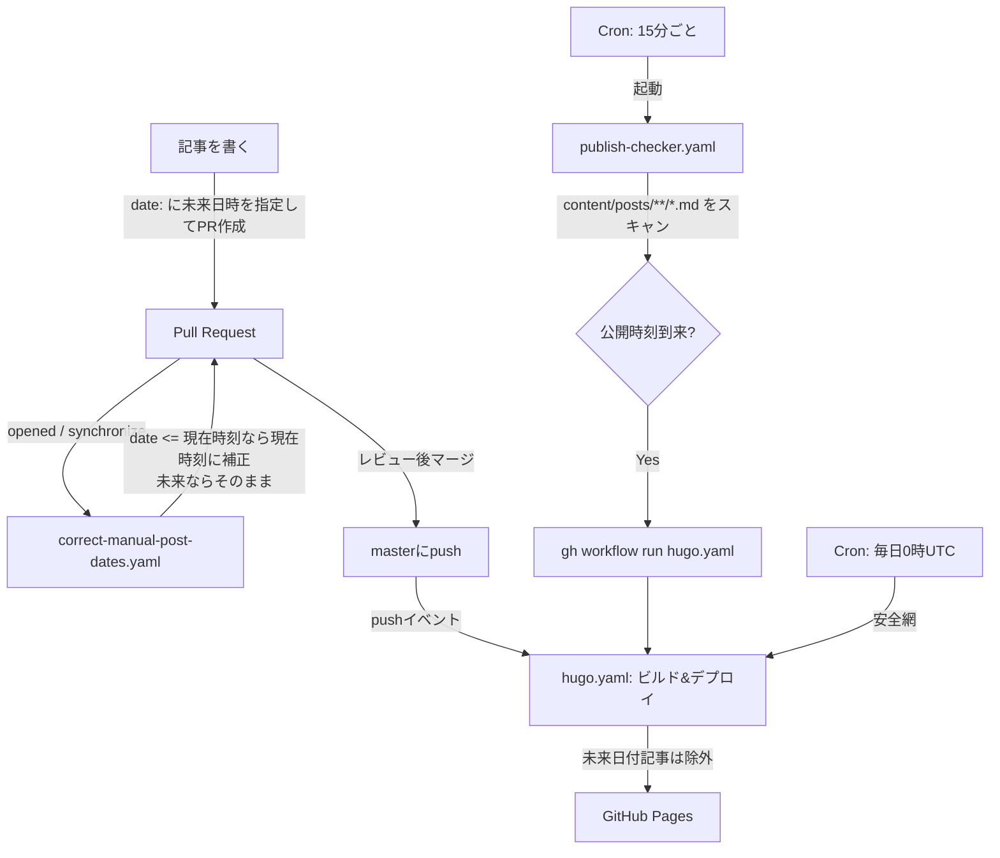

このブログはHugo + GitHub Pagesという、いわゆる「静的サイト」構成で動いている。ホスティングは無料でCDNも効くし、サーバーの面倒を見る必要もない。ただしこの構成には、WordPressのような動的CMSなら当たり前にある機能がひとつ欠けている。**予約投稿**だ。

Hugoはビルド時点の現在時刻より未来の`date:`を持つ記事をデフォルトでビルド対象から除外する(`buildFuture: false`相当の挙動)。裏を返せば、「未来日付の記事をmasterにマージしておいて、その時刻が来たら勝手にサイトに出てくる」ということは、**誰かが正しいタイミングでもう一度ビルドを起動しない限り起きない**。動的CMSなら公開時刻をDBに書いておいてリクエストのたびに判定すればいいが、静的サイトは「ビルドした瞬間の世界」を切り出して配信しているだけなので、時間の経過そのものをトリガーにできない。

この記事では、GitHub Actionsだけを使ってこの制約を回避し、実際に予約投稿を動かしている仕組みを、詰まった点も含めて書いておく。

# 全体構成



登場するワークフローは3つ。

- **`correct-manual-post-dates.yaml`**: PRを開いた/更新した時点で、新規追加記事の日時を補正する
- **`hugo.yaml`**: Hugoでビルドし、GitHub Pagesにデプロイする(未来日付の記事は自動的に除外される)
- **`publish-checker.yaml`**: 15分ごとに全記事をスキャンし、公開時刻が到来した未来日付記事があれば`hugo.yaml`を起動する

# 1. 記事の`date:`と「実際に公開された時刻」を一致させる

普段の運用(予約投稿ではなく、書いたらすぐ公開したい記事)では、`date:`フィールドに正確な時刻を毎回手で入れるのは面倒だし、書き始めた時刻とマージされた時刻がずれることも多い。そこで、PRの`opened`/`synchronize`イベントをトリガーに、新規追加されたMarkdownファイルの`date:`を機械的に補正するワークフローを用意した。

```yaml
- name: Correct publish dates of added posts
  run: |
    files_to_check=$(gh api "repos/${{ github.repository }}/pulls/$PR_NUMBER/files" \
      --paginate --jq '.[] | select(.status=="added") | .filename' \
      | grep -E '^content/posts/.*\.md$' | grep -v '_index.md' || true)

    if [ -n "$files_to_check" ]; then
      git fetch origin "$BRANCH"
      git checkout -B "$BRANCH" origin/"$BRANCH"
      python3 scripts/correct_publish_dates.py $files_to_check
      # ... 差分があれば github-actions[bot] としてPRブランチにコミット&push
    fi
```

ポイントは3つ。

1. **PRの差分APIで`status=="added"`のファイルだけを対象にする。** 既存記事を編集するPRまで日時補正が走ると、過去記事の公開日が現在時刻で上書きされてしまう。新規追加ファイルだけに絞ることでこれを防いでいる。
2. **`date:`が現在時刻以下なら、現在時刻(JST `+09:00`)に書き換える。** これが「即時公開」の記事の通常経路になる。
3. **`date:`が未来なら何もしない。** これがそのまま予約投稿の入口になる。

補正ロジック自体(`scripts/correct_publish_dates.py`)はシンプルで、正規表現で`date:`行を見つけてepoch秒に変換し、現在時刻と比較しているだけだ。

```python
if file_epoch <= now_epoch:
    new_content, count = re.subn(r'(?m)^date:\s*.*$', f'date: {now_iso}', content)
```

「未来なら何もしない」を明示的に書いていない(elseブロックがない)のが逆に分かりやすい。何もしなければ、フロントマターに書いた未来日時がそのままmasterに残る。

# 2. Branch Protectionと「マージ後に直接pushできない」問題

最初は「PRがマージされてから、`hugo.yaml`の中で日時を補正してmasterに直接コミットすればいいのでは」と考えていた。しかしmasterには`required_pull_request_reviews`と`enforce_admins: true`のBranch Protectionをかけているため、ワークフローからの直接pushは常に拒否される。

この制約に気づかず実装すると、デプロイジョブの途中でpushが失敗し、ビルド自体が止まってしまう。**解決策は、日時補正を「マージ後」ではなく「マージ前、PRブランチ上」で完結させること。** `correct-manual-post-dates.yaml`がPRブランチにコミットする設計にしているのはこのためで、`hugo.yaml`はマージされてきた内容をそのままビルドするだけの、日時補正処理を一切持たないシンプルなジョブになっている。

Branch Protectionという「壊れないための制約」が、結果的に「日時補正はマージ前に済ませる」という設計の単純化を後押しした形になる。

# 3. 補正コミットが自分自身の必須チェックをブロックする

補正ロジックを組んだ直後、地味にハマったのがこれだった。`correct-manual-post-dates.yaml`が補正コミットをPRブランチにpushすると、そのpushは**新たな`synchronize`イベント**を発生させる。ここまでは想定通りだが、このリポジトリでは`github-actions[bot]`名義のpushによって発生した`pull_request`トリガーのワークフロー実行が、なぜか**`action_required`(手動承認待ち)**の状態になる。

放置すると、必須ステータスチェック(`build`・`test`)が永久に緑にならず、人間がレビューを終えてマージしようとしてもブロックされたままになる。対処として、補正コミットをpushした直後に該当ブランチの`action_required`な実行をAPIで検索し、その場で承認するステップを追加した。

```bash
for i in $(seq 1 10); do
  run_ids=$(gh api "repos/${{ github.repository }}/actions/runs?branch=$BRANCH&event=pull_request" \
    --jq '.workflow_runs[] | select(.conclusion=="action_required") | .id')
  if [ -n "$run_ids" ]; then break; fi
  sleep 5
done

for run_id in $run_ids; do
  gh api -X POST "repos/${{ github.repository }}/actions/runs/$run_id/approve"
done
```

`action_required`になった実行がAPI上に現れるまでにラグがあるため、素朴にリトライループを回している。ボットが自分の起こしたイベントの後始末を自分でつける、という構図になっていて、最初にこの承認待ちでPRが固まったときは原因の特定に少し時間がかかった。

# 4. 未来日付の記事を「後から」公開する

ここまでで「未来日付の記事はmasterにそのままマージされ、Hugoのビルドでは除外される」という状態は作れる。残る問題は、**その未来時刻が実際に来たときに、誰が・どうやってもう一度ビルドを起動するか**だ。

`publish-checker.yaml`は15分ごとに全記事の`date:`をスキャンし、「現在時刻以下」かつ「現在時刻から20分前まで」のルックバック窓に入っている記事があれば`hugo.yaml`を`workflow_dispatch`で起動する。

```bash
now_epoch=$(date +%s)
window_start=$((now_epoch - 1200)) # 20分ルックバック

for file in content/posts/**/*.md; do
  # draft: true はスキップ、_index.md もスキップ
  date_val=$(grep -i "^date:[[:space:]]*" "$file" | ...)
  file_epoch=$(date -d "$date_val_clean" +%s 2>/dev/null)

  if [ "$file_epoch" -le "$now_epoch" ] && [ "$file_epoch" -gt "$window_start" ]; then
    found_any=true
  fi
done

[ "$found_any" = true ] && gh workflow run hugo.yaml
```

ルックバック窓を20分にしているのは、実行間隔(15分)より広く取ることで、多少の実行遅延があっても取りこぼさないようにするためだ。GitHubの`schedule`トリガーは混雑状況によって10分以上遅延することが実測でも確認できたので、「15分間隔だから15分あれば十分」とは考えず、余裕を持たせてある。

それでも取りこぼした場合の最終防衛ラインとして、`hugo.yaml`自体に`schedule: cron: '0 0 * * *'`(毎日1回)を仕込んである。ポーリングが何らかの理由で機能しなくても、遅くとも1日以内には必ず一度ビルドが走り、公開時刻を過ぎた記事はそこで拾われる。「15分ポーリング(速いが壊れうる)」と「日次フルビルド(遅いが確実)」の二段構えにすることで、片方が失敗してもサイトが永久に古いままになる事態を避けている。

# まとめ

- Hugoのような静的サイトジェネレータには「時間経過そのもの」をトリガーにする仕組みがないので、予約投稿を実現するには外側から定期的にビルドを叩き直す必要がある
- 日時補正は「PRブランチ上・マージ前」に完結させる。Branch Protectionのある`master`に対してワークフローから直接pushしようとすると必ず失敗するので、この順序は妥協できない
- 未来日付の記事は「何もしない」ことで自然に予約投稿として扱える。特別なフラグやステータス管理を追加していない
- ボットが自分のpushで発生させた`pull_request`イベントが`action_required`になる、という一見無関係な制約が、日時補正フローの中に承認ステップとして食い込んでくる。CIまわりの権限モデルを触るときは、こういう「自分の行動が自分の後続処理をブロックする」ループがないか疑う価値がある
- ポーリング間隔より広いルックバック窓と、日次フルビルドという安全網の二段構えで、GitHub Actionsの`schedule`トリガー特有の遅延を吸収している

GitHub Pagesとカスタムドメインだけで完結する構成なので、サーバー運用のコストはゼロに近い。その代わり、「動的CMSなら意識しなくていい制約」をひとつずつ静的サイトの側に持ち込んで解決する必要があり、そこが地味に面白いところだと感じている。
