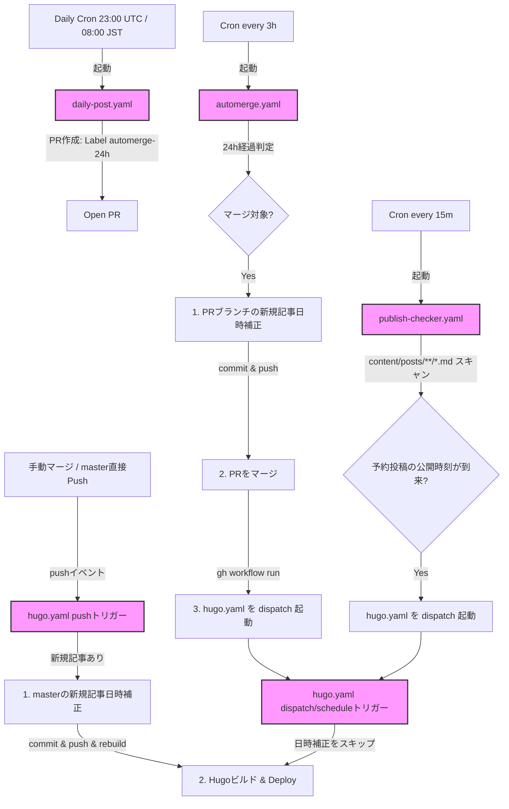

# デプロイフローおよび公開日時補正仕様

このドキュメントでは、本ブログにおける記事生成から自動マージ、日時の自動補正、予約投稿、およびデプロイ（GitHub Pagesへの配信）に至るワークフローの全体像と詳細な仕様について説明します。

---

## 1. ワークフロー全体図と役割

本リポジトリは、以下の4つのGitHub Actionsワークフローを組み合わせて運用されています。

- **`daily-post.yaml` (Daily Automated Post)**: 日次自動投稿作成
- **`automerge.yaml` (Auto-Merge AI Posts)**: 24時間経過後の自動マージ & マージ前日時補正 & デプロイ即時起動
- **`hugo.yaml` (Deploy Hugo site to Pages)**: ブログビルド＆デプロイ & 手動マージ日時補正
- **`publish-checker.yaml` (Scheduled Publish Polling)**: 予約投稿用のポーリング＆デプロイ自動起動

### ワークフローの実行順序とトリガー関係



---

## 2. 根本原因：GITHUB_TOKEN の制限と解決策

### 根本原因 (GITHUB_TOKEN の仕様制限)
GitHub Actionsのセキュリティ仕様として、ワークフロー内で自動的に利用される `GITHUB_TOKEN` を使用してリポジトリへの `git push` や Pull Request のマージを行うと、**それによって生じたイベント（例: masterへのpush）は他のワークフローの `push` トリガーを起動しません**（無限ループ防止のためのガード）。

以前の構成では、`automerge.yaml` が `GITHUB_TOKEN` を使ってPRをマージしていましたが、これにより `hugo.yaml` の `on: push` が起動しませんでした。その結果、デプロイ処理は `hugo.yaml` 自身のスケジュール（6時間ごとのcron）を待つしかなく、マージされてから実際のサイト公開までに最大6時間の遅延が発生していました。

### 解決策
`automerge.yaml` でマージが成功した直後に、GitHub CLIを使用してデプロイワークフローを明示的に起動するようにしました。
```bash
gh workflow run hugo.yaml
```
これにより、`GITHUB_TOKEN` によるマージ後であっても、`workflow_dispatch` トリガー経由で `hugo.yaml` が即座に起動し、不要なデプロイ遅延が解消されました。

---

## 3. 日時補正ルール

本ブログでは、記事の公開タイミング（`date:` フロントマター）と実際のサイト上での表示・公開日時を一致させるため、自動的な日時補正ルールが適用されます。

### 日時補正のルール一覧

1. **新規追加ファイルのみが対象**
   - 補正が走る際、既存の過去記事に影響を与えないよう、**そのマージまたはプッシュで「新規追加されたファイル」のみ**を日時補正の対象にします。
   - **ガードの仕組み**:
     - `automerge.yaml` では、PR内の差分情報を取得し、ステータスが `added` である `content/posts/*.md` のみを対象とします。
     - `hugo.yaml` では、`git diff --name-status` を用い、`A`（追加）ステータスである `content/posts/*.md` のみを対象とします。
   - これにより、既存記事の日時が勝手に現在時刻に上書きされる（デプロイのたびに更新されてしまう）問題を防いでいます。

2. **現在時刻以下なら「公開確定時刻」に書き換え**
   - 新規記事の `date:` が「現在時刻以下（過去または現在）」の場合、公開が確定した時点の時刻（`+09:00` JST表記）に書き換えられます。
     - AI自動生成記事は、生成時点の過去日付のままであるため、自動マージが実行された時刻に書き換わります。
     - 手動で作成された記事も、マージボタンが押されてmasterにマージされた時刻に書き換わります。

3. **未来日付はそのまま尊重（予約投稿）**
   - `date:` が現在時刻より未来である場合は、補正ロジックは何も行わず、日付をそのまま維持します。これにより「予約投稿」として扱われます。

4. **タイムゾーン表記の統一**
   - 補正後の日時は、常に日本標準時（JST）の `+09:00` 表記（例: `2026-08-21T18:52:08+09:00`）に統一されます。

---

## 4. 予約投稿（未来日付指定）の使い方

将来の特定の時間に記事を自動公開したい場合、以下の手順で予約投稿を行うことができます。

### 予約投稿の手順

1. **記事の `date:` フロントマターに未来の日時を指定する**
   - 日本時間（JST）の `+09:00` 形式で指定してください。
   ```yaml
   ---
   title: "将来公開するテスト記事"
   date: 2026-08-25T09:00:00+09:00
   draft: false
   ---
   ```
2. **通常どおりPRを作成し、マージする**
   - マージ時の補正ロジックは、未来の日付を検知すると書き換えを行いません。そのため、未来日付のままmasterにマージされます。
   - Hugoのビルド設定では未来日付の記事は除外されるため、この時点ではまだサイト上には公開されません（ビルド成果物に含まれません）。

### 自動公開の仕組み（ポーリング）

- 新規ワークフロー `publish-checker.yaml` が **15分間隔** で実行されます。
- このワークフローは `content/posts/**/*.md` の `date:` フィールドをスキャンし、**「現在時刻以下」かつ「現在時刻から20分前まで（ルックバック窓）」** に公開予定時刻が到来した記事があるかをチェックします。
- 該当する記事が検知されると、自動的に `hugo.yaml` を `workflow_dispatch` で起動します。
- これにより、Hugoのビルド対象にその記事が含まれるようになり、サイト上に公開されます。

> [!NOTE]
> **公開時の遅延について**
> ポーリングが15分間隔であるため、指定した公開予定日時から実際にサイトに反映されるまでは、**最大で 15分 ＋ GitHub Actions の実行遅延（混雑状況による）** の遅延が発生する可能性があります。正確な分秒単位の公開を要求する場合は、余裕を持った時間を指定してください。
